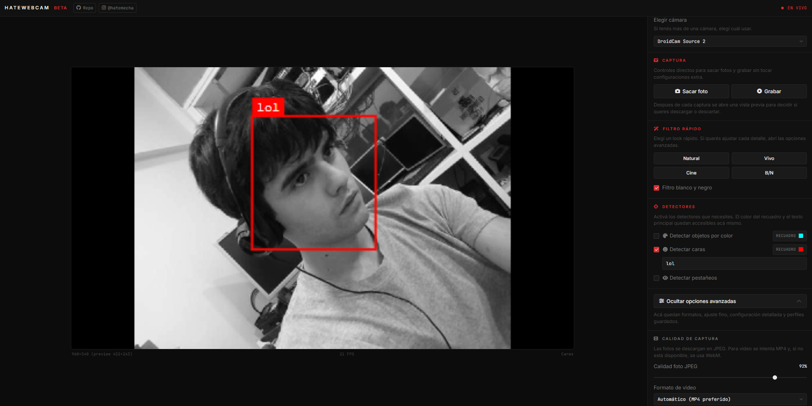

# hatewebcam

Aplicacion web para usar la camara con filtros en tiempo real, detectores visuales (color, caras y pestaneos), captura de foto/video y vista previa antes de descargar.

> **BETA**



## Que ofrece

- Vista previa en vivo con controles de imagen.
- Captura de **foto (JPEG)** y **video (MP4/WebM segun compatibilidad)**.
- Vista previa post-captura con metadata (resolucion, formato, tamano, etc.).
- Opcion de mejorar la foto desde la vista previa antes de descargar.
- Detectores: objetos por color, caras (Face Mesh) y pestaneos.
- Perfiles guardados en el navegador para recuperar configuraciones.
- Interfaz responsive con HUD dedicado en moviles.

## Requisitos

- Navegador moderno (recomendado: Chrome/Edge actual).
- Camara disponible y permisos habilitados.
- Servir la app desde `localhost` o `https` (no usar `file://`).
- Conexion a internet para cargar Face Mesh desde CDN cuando se activan detectores de cara/pestaneos.

## Inicio rapido


Desde la carpeta del proyecto:

```bash
python -m http.server 8080
```

Luego abre:

```text
http://localhost:8080
```

## Uso basico

1. Abre la app y permite acceso a la camara.
2. Elige camara si tienes mas de una.
3. Ajusta filtros rapidos o ajuste fino.
4. Activa detectores si los necesitas.
5. Saca foto o graba video.
6. En la vista previa decide: `Descargar` o `Descartar`.

## Persistencia de configuracion

La app guarda ajustes en `localStorage` del navegador:

- `hatewebcam_config`: configuracion general.
- `hatewebcam_profiles`: perfiles guardados.

Si necesitas resetear todo, limpia esos valores desde DevTools o borra datos del sitio.


## Dependencias externas

- [Font Awesome](https://cdnjs.com/libraries/font-awesome) (iconos).
- [MediaPipe Face Mesh](https://www.npmjs.com/package/@mediapipe/face_mesh) (carga dinamica desde jsDelivr).

## Privacidad

- El procesamiento principal se realiza en el navegador.
- Las capturas se descargan localmente por el usuario.
- No hay backend propio en este repositorio.

## Futuras mejoras
- Abrir imagenes + editor


---
hatemecha @ alex romero
