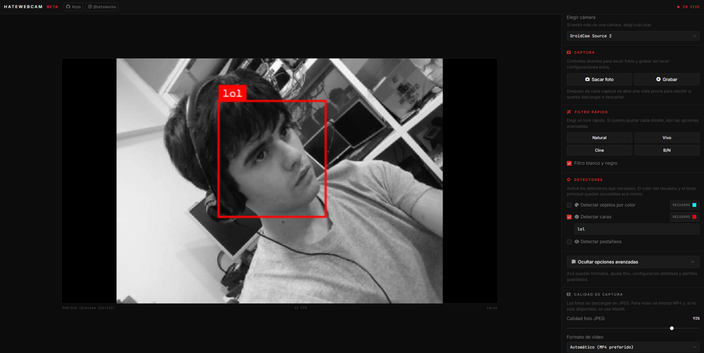

# hatewebcam

Aplicación web para usar la cámara con filtros en tiempo real, detectores visuales (color, caras y pestañeos), captura de foto/video y vista previa antes de descargar.

> **BETA**



## Qué ofrece

- Vista previa en vivo con controles de imagen.
- Captura de **foto (JPEG)** y **video (MP4/WebM según compatibilidad)**.
- Vista previa post-captura con metadata (resolución, formato, tamaño, etc.).
- Opción de mejorar la foto desde la vista previa antes de descargar.
- Detectores: objetos por color, caras (Face Mesh) y pestañeos.
- Perfiles guardados en el navegador para recuperar configuraciones.
- Interfaz responsive con HUD dedicado en móviles.
- Editor local de video con recorte y efectos por intervalos sobre una timeline interactiva.

## Requisitos

- Navegador moderno (recomendado: Chrome/Edge actual).
- Cámara disponible y permisos habilitados.
- Servir la app desde `localhost` o `https` (no usar `file://`).
- Conexión a internet para cargar Face Mesh desde CDN cuando se activan detectores de cara/pestañeos.

## Inicio rápido

### Opción recomendada (GitHub Pages)

La forma correcta de usar el proyecto es esta URL:

```text
https://hatemecha.github.io/hatewebcam-web/
```

### Opción local (desarrollo)

Desde la carpeta del proyecto:

```bash
python -m http.server 8080
```

Luego abre:

```text
http://localhost:8080
```

## Uso básico

1. Abre la app y permite acceso a la cámara.
2. Elige cámara si tienes más de una.
3. Ajusta filtros rápidos o ajuste fino.
4. Activa detectores si los necesitas.
5. Saca una foto o graba video.
6. En la vista previa decide: `Descargar` o `Descartar`.

## Editor de video

1. Abre la pestaña `Video` y elige un archivo local.
2. Arrastra los extremos de la timeline para recortar y marca sobre ella los intervalos de efectos.
3. Configura un look o detector y agrégalo al tramo marcado.
4. Exporta; un modal bloquea la edición hasta iniciar la descarga final.

La exportación es local, sin audio, conserva la resolución original y tarda aproximadamente lo mismo que el tramo elegido. El codec final depende del navegador.

## Verificación

Para ejecutar checks básicos de sintaxis y estructura:

```bash
npm test
```

## Persistencia de configuración

La app guarda ajustes en `localStorage` del navegador:

- `hatewebcam_config`: configuración general.
- `hatewebcam_profiles`: perfiles guardados.

Si necesitás resetear todo, limpia esos valores desde DevTools o borra datos del sitio.


## Dependencias externas

- [Font Awesome](https://cdnjs.com/libraries/font-awesome) (iconos).
- [MediaPipe Face Mesh](https://www.npmjs.com/package/@mediapipe/face_mesh) (carga dinámica desde jsDelivr, versión fijada).

## Privacidad

- El procesamiento principal se realiza en el navegador.
- Las capturas se descargan localmente por el usuario.
- No hay backend propio en este repositorio.

---
hatemecha @ alex romero
