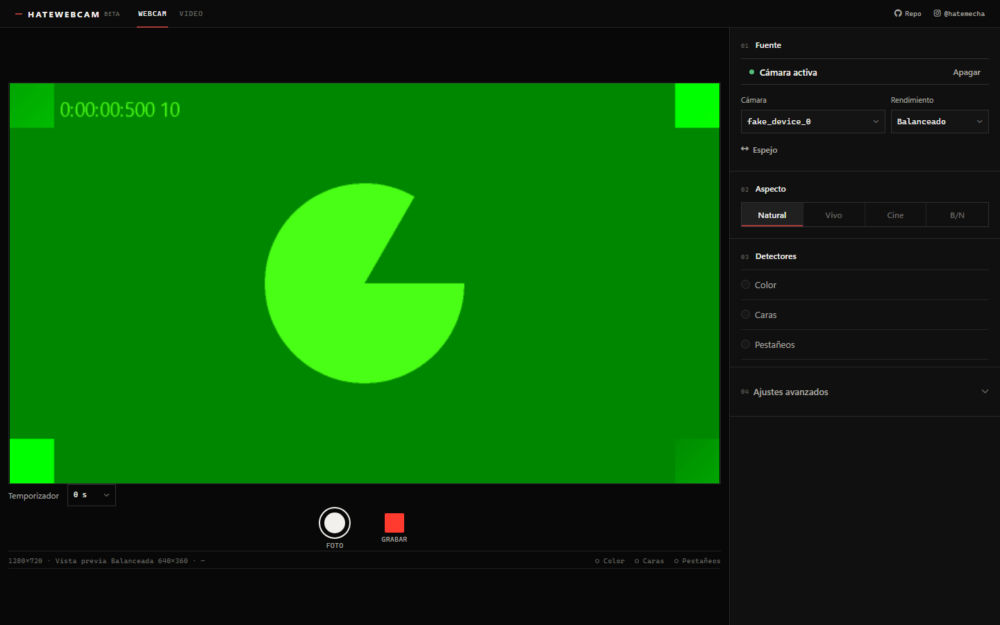
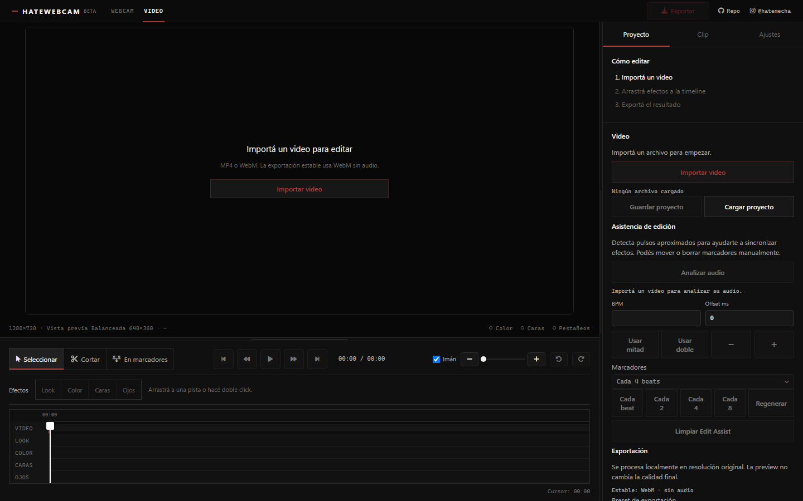

# hatewebcam

Aplicación web para usar la cámara con filtros en tiempo real, detectores visuales (color, caras y pestañeos), captura de foto/video y vista previa antes de descargar.

> **Estado:** beta pública. Es un proyecto personal en desarrollo; puede haber cambios de interfaz y compatibilidad entre navegadores.



## Qué ofrece

- Vista previa en vivo con controles de imagen.
- Captura de **foto (JPEG)** y **video (MP4/WebM según compatibilidad)**.
- Vista previa post-captura con metadata (resolución, formato, tamaño, etc.).
- Opción de mejorar la foto desde la vista previa antes de descargar.
- Detectores: objetos por color, caras (Face Mesh) y pestañeos.
- Perfiles guardados en el navegador para recuperar configuraciones.
- Interfaz responsive con HUD dedicado en móviles.
- Editor local de video con recorte y efectos por intervalos sobre una timeline interactiva.

## Requisitos

- Node.js `^20.19.0` o `>=22.12.0` para desarrollo y build.
- Navegador moderno (recomendado: Chrome/Edge actual).
- Cámara disponible y permisos habilitados.
- Servir la app desde `localhost` o `https` (no usar `file://`).
- No requiere CDN en runtime: iconos, Face Mesh y exportación están vendorizados en `vendor/`.

## Inicio rápido

### Opción recomendada (GitHub Pages)

La forma correcta de usar el proyecto es esta URL:

```text
https://hatemecha.github.io/hatewebcam-web/
```

### Opción local (desarrollo recomendado)

Desde la carpeta del proyecto:

```bash
npm ci
npm run dev
```

Luego abre:

```text
http://localhost:5173
```

Checks útiles:

```bash
npm test
npm run lint
npm run build
npm run preview
```

### Publicación y caché

GitHub Pages se publica desde el artefacto `dist` generado por Vite mediante
`.github/workflows/pages.yml`. En **Settings → Pages**, la fuente debe ser
**GitHub Actions**. Vite genera nombres con hash de contenido para CSS,
JavaScript, fuentes y workers; por eso un despliegue nuevo cambia las URLs de
los assets modificados sin mantener versiones manuales en `index.html`.

La opción `base: './'` de `vite.config.mjs` permite que esos assets funcionen
tanto en preview local como bajo la ruta `/hatewebcam-web/` de GitHub Pages.

Alternativa estática simple:

```bash
python -m http.server 8080
```

## Uso básico

1. Abre la app y permite acceso a la cámara.
2. Elige cámara si tienes más de una.
3. Ajusta filtros rápidos o ajuste fino.
4. Activa detectores si los necesitas.
5. Saca una foto o graba video.
6. En la vista previa decide: `Descargar` o `Descartar`.

## Editor de video



1. Abre la pestaña `Video` y elige un archivo local.
2. Arrastra los extremos de la timeline para recortar y marca sobre ella los intervalos de efectos.
3. Configura un look o detector y agrégalo al tramo marcado.
4. Pulsa `M` para agregar o quitar marcadores en el playhead. Con el imán activo, trims, clips y cursor ajustan también a esos marcadores.
5. Exporta; un modal bloquea la edición hasta iniciar la descarga final.

### Grabación de cámara

- Formato: automático, MP4 o WebM según lo que soporte `MediaRecorder`.
- Las fotos se descargan en JPEG.

### Exportación del editor

- Modo `Video + efectos`: Auto/MP4/WebM. Auto prefiere WebM VP9/VP8 por velocidad; MP4 H.264 queda disponible como opción explícita.
- Modo `Solo efectos chroma`: WebM con fondo verde o azul, sin audio y sin video base, pensado para componer en otro editor.
- La resolución, FPS y bitrate se calculan según el preset: `fast` puede bajar a 720p/30, `balanced` a 1080p/30, `high` mantiene tamaño original hasta 60 FPS y `chroma` exporta overlays en WebM.
- `Copiar audio original` intenta copia packet-level solo si el codec es compatible con el contenedor elegido; si no lo es, exporta sin audio e informa el motivo.
- No se integra `ffmpeg.wasm`.

## Verificación

Para ejecutar checks básicos de sintaxis y estructura:

```bash
npm test
npm run lint
npm run build
npm run test:browser
```

## Persistencia de configuración

La app guarda ajustes en `localStorage` del navegador:

- `hatewebcam_config`: configuración general.
- `hatewebcam_profiles`: perfiles guardados.

Si necesitás resetear todo, limpia esos valores desde DevTools o borra datos del sitio.

## Dependencias Runtime

Están vendorizadas para que la app sea local/offline en runtime:

- Font Awesome 6.5.1: `vendor/fontawesome/`.
- MediaPipe Face Mesh 0.4.1633559619: `vendor/mediapipe/face_mesh/`.
- Mediabunny 1.49.0: `vendor/mediabunny/`.

## Privacidad

- El procesamiento principal se realiza en el navegador.
- Las capturas se descargan localmente por el usuario.
- Los ajustes y perfiles se guardan únicamente en `localStorage`.
- La aplicación no incluye telemetría, analytics ni backend propio.
- En runtime no solicita recursos a CDN; las únicas navegaciones externas son enlaces iniciados por el usuario.

## Limitaciones conocidas

- La cámara requiere `https` o `localhost` y permiso explícito del navegador.
- Los formatos y codecs disponibles dependen de `MediaRecorder`, WebCodecs y del navegador/sistema operativo.
- Face Mesh usa WebAssembly y puede consumir recursos apreciables en equipos o móviles modestos.
- La exportación puede omitir audio cuando el codec original no es compatible con el contenedor elegido.

## Estructura del proyecto

- `js/app/`: controladores y UI de webcam/editor.
- `js/core/`, `js/editor/`, `js/effects/`: lógica reutilizable de cámara, timeline y detectores.
- `templates/`: fragmentos HTML cargados por la aplicación.
- `vendor/`: dependencias de runtime vendorizadas con sus licencias.
- `tests/`: checks unitarios, de estructura y de navegador.

La aplicación es estática: no necesita backend ni cuentas privadas para ejecutarse o mantener un fork funcional.

## Seguridad / CSP

- La app no sube archivos a servidores ni carga scripts desde CDN en runtime.
- La CSP mantiene `unsafe-eval`, `wasm-unsafe-eval` y `blob:` por compatibilidad con MediaPipe Face Mesh, WebAssembly, Workers locales y exportación.

## Contribuir

Los bugs y propuestas se gestionan en [GitHub Issues](https://github.com/hatemecha/hatewebcam-web/issues). Antes de enviar cambios, consultá [CONTRIBUTING.md](CONTRIBUTING.md).

## Licencia

El código propio se distribuye bajo [MIT](LICENSE). Los componentes vendorizados conservan sus licencias; consultá [THIRD_PARTY_NOTICES.md](THIRD_PARTY_NOTICES.md).

Mantenido por Alex Romero (`hatemecha`).
